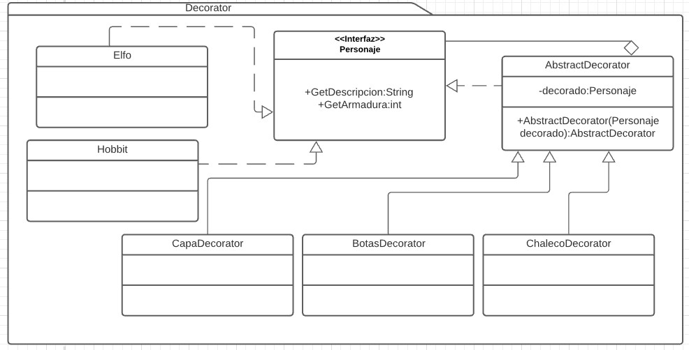

# Decorator
Es un patrón estructural. [Link descripción](https://sourcemaking.com/design_patterns/decorator)

El decorador es un patrón que se utiliza para agregar funcionalidad a una clase sin tener que heredarla ni modificarla, se utilizan clases "decoradoras" que implementan la misma interfaz pero pueden agregar funcionalidad a cada uno de sus métodos.

## Diagrama de clases

## SOLID

* Single responsibility

Cada decorador tiene una sola responsabilidad, la de agregar una unidad de funcionalidad a una clase concreta.

* Open/Closed principle

Gracias al patrón podemos implementar nueva funcionalidad a una clase sin tener que modificarla. Si se necesitan más puntos de extensión basta con crear nuevos decoradores y encolarlos

* Liskov substitution

Por naturaleza los decorators son "apilables" y cada uno se comporta como su padre, no hay razón para que rompan este principio

* Interface segregation

El decorator ayuda a la segregación de interfaces ya que tienen una reducida responsabilidad y son encolables, cada decorator puede apuntar a una funcionalidad especifica ayudando a mantener clases pequeñas y especializadas.

* Dependency inversion

Un decorador se maneja a través de interfaces, lo que viene muy bien para cumplir con este principio

